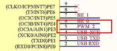
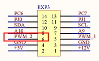
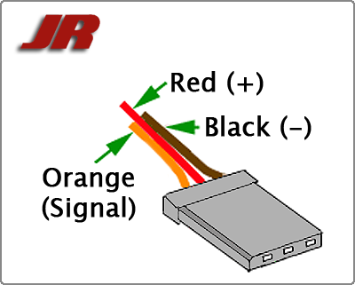
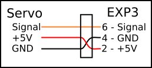

# Servo
## Consolidated information

### pins/ramps/pins_TANGO.h
No mention of servos here but includes RUMBA pins definitions
```C++
#include "pins_RUMBA.h" 
```

### pins/ramps/pins_RUMBA.h
```C++
//
// Servos
//
#define SERVO0_PIN                             5
```
Pin 5 of the ATMEGA2560 is called PWM2 on the schematic 



and goes to Auxilary IO connector EXP3 pin 6.



Servo pinout




Using a servo Extention cable the +5 and GND signals coming from the servo was swapped to match the hookup of the EXP3 connector. Then it plugs in directly



Used Servo Extension Cord From [Amazon](https://www.amazon.com/gp/product/B07C18BXDV/ref=ppx_yo_dt_b_search_asin_title?ie=UTF8&psc=1 "Servo Extension Cords")